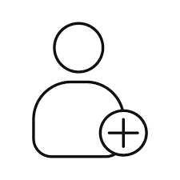

# aleklein.github.io
alejandra kleinerman
<!DOCTYPE html>
<html lang="es">
<head>
    <meta charset="UTF-8">
    <meta http-equiv="X-UA-Compatible" content="IE=edge">
    <meta name="viewport" content="width=device-width, initial-scale=1.0">
    <title>Curriculum Alejandra Kleinerman</title>
    <link rel="preconnect" href="https://fonts.googleapis.com">
    <link rel="preconnect" href="https://fonts.gstatic.com" crossorigin>
    <link href="https://fonts.googleapis.com/css2?family=Michroma&display=swap" rel="stylesheet">
    <link rel="stylesheet" href="css/normalize.css">
    <link rel="stylesheet" href="css/curriculum.css">
</head>
<body>
    <header>
        <h1>Alejandra Kleinerman</h1>
    
    
    
    

    

</header>
<nav>
    <ul class="holder">
        <li><a class="activo" href="index.html">Home</a></li>
        <li><a href="sobremi.html">Sobre mi </a></li>
        <li><a href="estudios.html">Mis estudios </a></li>
        <li><a href="cursos.html">Mis cursos </a></li>
        <li><a href="experiencia.html">Experiencias</a></li>
        <li><a href="contacto.html">Contacto </a></li>
    </ul>
</nav>
<main class="holder">
    <section class="historia">
        <h2>Mi Curriculum Vitae</h2>
        
Lorem ipsum, dolor sit amet consectetur adipisicing elit. 
            Rem quia nam porro eum magni possimus neque, repellendus ex 
            laboriosam deserunt beatae accusamus. 
            Earum veniam pariatur ipsam odio facere, natus sit!.

     
      
    </section>
    <section class="iconos Holder">
        

            <h5>ESTUDIOS</h5>
            
            
            
        

        

            <h5>CURSOS</h5>
            
            
           
        

        

            <h5>EXPERIENCIA</h5>
            
            
            
        

             <h5>CONTACTO</h5>
            
            
    
        

    

    </section>
  
  <!DOCTYPE html>
<html lang="es">
<head>
    <meta charset="UTF-8">
    <meta http-equiv="X-UA-Compatible" content="IE=edge">
    <meta name="viewport" content="width=device-width, initial-scale=1.0">
    <title>Curriculum Vitae de Ale Klein</title>
    <link rel="preconnect" href="https://fonts.googleapis.com">
    <link rel="preconnect" href="https://fonts.gstatic.com" crossorigin>
    <link href="https://fonts.googleapis.com/css2?family=Michroma&display=swap" rel="stylesheet">
    <link rel="stylesheet" href="css/normalize.css">
    <link rel="stylesheet" href="css/curriculum.css">
</head>
<body>
    <header>
        <h1>Sobre  mi</h1>
        
</header>
<nav>
    <ul class="holder">
        
        <li><a  href="index.html">Home</a></li>
        <li><a class="activo" href="sobremi.html">Sobre mi </a></li>
        <li><a href="estudios.html"> Mis estudios </a></li>
        <li><a href="cursos.html">Mis cursos</a></li>
        <li><a href="experiencia.html">Experiencias </a></li>
        <li><a href="contacto.html">Contacto</a></li>
    </ul>
</nav>
<main class="holder">
    <section class="sobremi">
      
        

             
        <h1>Alejandra Griselda Kleinerman</h1>
        <h2>DISEÑADORA GRAFICA</h2>
        <h2>INTERPRETE DE LENGUA DE SEÑAS ARGENTINA</h2>
        <h3>ARGENTINA</h3>
        <h5>D.N.I. 24856526</h5>
        <h6>22/09/1975</h6>
        
        
Lorem ipsum dolor sit amet consectetur adipisicing elit. Reprehenderit 
            quisquam eos autem perspiciatis nisi explicabo consectetur quo. Velit modi, 
            quibusdam animi quas, possimus dolor cupiditate dolores doloribus pariatur
             voluptatum voluptates?

             

                

                <h4>Mis redes</h4>
                
              

              

                
              

    </section>

</main>
    <footer> Diseño :   Alejandra Kleinerman :: 2023 </footer>
</body>

</html>
<!DOCTYPE html>
<html lang="es">
<head>
    <meta charset="UTF-8">
    <meta http-equiv="X-UA-Compatible" content="IE=edge">
    <meta name="viewport" content="width=device-width, initial-scale=1.0">
    <title>Curriculum Alejandra Kleinerman</title>
    <link rel="preconnect" href="https://fonts.googleapis.com">
    <link rel="preconnect" href="https://fonts.gstatic.com" crossorigin>
    <link href="https://fonts.googleapis.com/css2?family=Michroma&display=swap" rel="stylesheet">
    <link rel="stylesheet" href="css/normalize.css">
    <link rel="stylesheet" href="css/curriculum.css">
</head>
<body>
    <header>
        <h1>Trabajos</h1>
    
</header>
<nav>
    <ul class="holder">
        <li><a href="index.html">Home</a></li>
        <li><a href="sobremi.html">Sobre mi</a></li>
        <li><a  href="estudios.html">Mis estudios </a></li>
        <li><a href="cursos.html">Mis cursos </a></li>
        <li><a class="activo" href="Experiencia.html">Experiencias</a></li>
        <li><a href="contacto.html">Contacto </a></li>
    </ul>
</nav>
<main class="holder">
    <h2>Experiencias</h2>
       

           <h3>Diseño gráfico</h3>
           <h4>Editorial Magendra</h4>
           <h6>Año 2000</h6>
               
Lorem ipsum dolor sit amet consectetur adipisicing elit.
                 Odio mollitia voluptatum, dolor a necessitatibus quisquam ab, dolorum eligendi sit itaque, 
                 architecto quam eveniet blanditiis similique expedita placeat impedit voluptatibus dicta?

               
               

       

       

       <h3>Diseño gráfico</h3>
           <h4>Imprentas</h4>
           <h6>Año 1998 a 1999</h6>
               
Lorem ipsum dolor sit amet consectetur adipisicing elit.
                 Odio mollitia voluptatum, dolor a necessitatibus quisquam ab, dolorum eligendi sit itaque, 
                 architecto quam eveniet blanditiis similique expedita placeat impedit voluptatibus dicta?

     
            
    

    <h3>Diseño gráfico</h3>
        <h4>Imprentas</h4>
        <h6>Año 1998 a 1999</h6>
            
Lorem ipsum dolor sit amet consectetur adipisicing elit.
              Odio mollitia voluptatum, dolor a necessitatibus quisquam ab, dolorum eligendi sit itaque, 
              architecto quam eveniet blanditiis similique expedita placeat impedit voluptatibus dicta?

     

    </main>
    <footer> Diseñedo por: Alejandra Kleinerman ::2023 </footer>
    
</body>
</html>
<!DOCTYPE html>
<html lang="es">
<head>
    <meta charset="UTF-8">
    <meta http-equiv="X-UA-Compatible" content="IE=edge">
    <meta name="viewport" content="width=device-width, initial-scale=1.0">
    <title>Curriculum Alejandra Kleinerman</title>
    <link rel="preconnect" href="https://fonts.googleapis.com">
    <link rel="preconnect" href="https://fonts.gstatic.com" crossorigin>
    <link href="https://fonts.googleapis.com/css2?family=Michroma&display=swap" rel="stylesheet">
    <link rel="stylesheet" href="css/normalize.css">
    <link rel="stylesheet" href="css/curriculum.css">
</head>
<body>
    <header>
        <h1>Estudios</h1>
    
</header>
<nav>
    <ul class="holder">
        <li><a href="index.html">Home</a></li>
        <li><a href="sobremi.html">Sobre mi</a></li>
        <li><a class="activo" href="estudios.html">Mis estudios </a></li>
        <li><a href="cursos.html">Mis cursos </a></li>
        <li><a href="experiencia.html">Experiencias</a></li>
        <li><a href="contacto.html">Contacto </a></li>
    </ul>
</nav>
<main class="holder">
    <section class="estudios">
        <h1>Estudios</h1>

    
 
     
    <h2>Universitarios</h2>
               
            <h4>Universidad de Salta. En curso</h4>
          <h6> 2023 </h6> 
 

     

     
    
        <h2>Terciarios</h2>
       
        <h4>Nueva Escuela de Diseño y comunicación.  Promdedio: 8</h4>
            <h6>1994 - 1997</h6>
        
            
 

        <h2>Secundarios</h2>
           
            <h4>E.M.E.T. Nº7  Promdedio: 8</h4>
            <h6>1989 - 1994</h6>

            
 

       
    </section>
    </main>
    <footer> Diseñedo por: Alejandra Kleinerman ::2023 </footer>
    
</body>
</html>
<!DOCTYPE html>
<html lang="es">
<head>
    <meta charset="UTF-8">
    <meta http-equiv="X-UA-Compatible" content="IE=edge">
    <meta name="viewport" content="width=device-width, initial-scale=1.0">
    <title>Curriculum Alejandra Kleinerman</title>
    <link rel="preconnect" href="https://fonts.googleapis.com">
    <link rel="preconnect" href="https://fonts.gstatic.com" crossorigin>
    <link href="https://fonts.googleapis.com/css2?family=Michroma&display=swap" rel="stylesheet">
    <link rel="stylesheet" href="css/normalize.css">
    <link rel="stylesheet" href="css/curriculum.css">
</head>
<body>
    <header>
        <h1>Cursos</h1>
   
</header>
<nav>
    <ul class="holder">
        <li><a href="index.html">Home</a></li>
        <li><a href="sobremi.html">Sobre mi </a></li>
        <li><a href="estudios.html">Mis estudios </a></li>
        <li><a class="activo" href="cursos.html">Mis cursos</a></li>
        <li><a href="experiencia.html">Experiencias</a></li>
        <li><a href="contacto.html">Contacto </a></li>
    </ul>
</nav>
<main class="holder">
    <section class="cursos">
        <h2>Cursos<h2>
            

            <h3>Diseño gráfico</h3>
            <h4>Imprentas</h4>
            <h6>Año 1998 a 1999</h6>
                
Lorem ipsum dolor sit amet consectetur adipisicing elit.
                  Odio mollitia voluptatum, dolor a necessitatibus quisquam ab, dolorum eligendi sit itaque, 
                  architecto quam eveniet blanditiis similique expedita placeat impedit voluptatibus dicta?

 
      
            
     

       
            

            
            <h3>Diseño gráfico</h3>
            <h4>Imprentas</h4>
            <h6>Año 1998 a 1999</h6>
                
Lorem ipsum dolor sit amet consectetur adipisicing elit.
                  Odio mollitia voluptatum, dolor a necessitatibus quisquam ab, dolorum eligendi sit itaque, 
                  architecto quam eveniet blanditiis similique expedita placeat impedit voluptatibus dicta?

 
      
            
     

     

            
     <h3>Diseño gráfico</h3>
     <h4>Imprentas</h4>
     <h6>Año 1998 a 1999</h6>
         
Lorem ipsum dolor sit amet consectetur adipisicing elit.
           Odio mollitia voluptatum, dolor a necessitatibus quisquam ab, dolorum eligendi sit itaque, 
           architecto quam eveniet blanditiis similique expedita placeat impedit voluptatibus dicta?

            

            
<h3>Diseño gráfico</h3>
<h4>Imprentas</h4>
<h6>Año 1998 a 1999</h6>
    
Lorem ipsum dolor sit amet consectetur adipisicing elit.
      Odio mollitia voluptatum, dolor a necessitatibus quisquam ab, dolorum eligendi sit itaque, 
      architecto quam eveniet blanditiis similique expedita placeat impedit voluptatibus dicta?

            

    </section>

    </main>

    <footer> Diseñedo por: Alejandra Kleinerman :: 2023  </footer>
    
</body>
</html>
<!DOCTYPE html>
<html lang="en">
<head>
    <meta charset="UTF-8">
    <meta http-equiv="X-UA-Compatible" content="IE=edge">
    <meta name="viewport" content="width=device-width, initial-scale=1.0">
    <title>Curriculum Alejadra Kleinerman</title>
    <link rel="preconnect" href="https://fonts.googleapis.com">
    <link rel="preconnect" href="https://fonts.gstatic.com" crossorigin>
    <link href="https://fonts.googleapis.com/css2?family=Michroma&display=swap" rel="stylesheet">
    <link rel="stylesheet" href="css/normalize.css">
    <link rel="stylesheet" href="css/curriculum.css">

</head>
<body>
    <header>
        <h1>Contacto</h1>
    
</header>
<nav>
    <ul class="holder">
        <li><a href="index.html">Home</a></li>
        <li><a href="sobremi.html">Sobre mi </a></li>
        <li><a href="estudios.html">Mis estudios </a></li>
        <li><a href="cursos.html">Mis cursos </a></li>
        <li><a href="experiencia.html">Experiencias</a></li>
        <li><a class="activo"  href="contacto.html">Contacto</a></li>
    </ul>
</nav>
<main class="formulario holder">
    

  <form action="" method="">
      
Podes ponerte en contacto conmigo aqui!
      
<label for="">Nombre</label>
      <input type="text">

        

      <label for="">Apellido</label>
      <input type="text">
    

    

      <label for="">Telefono</label>
      <input type="text">
    

    

      <label for="">Correo</label>
      <input type="text">
    

    

      <label for="">Comentarios</label>
      <textarea name="" id="" cols="30" rows="10"></textarea>
    

    
  <input type="submit" value="Enviar" >

  </form>

    <h2>Otras vias de contacto</h2>
   <ul>
    <li> celular: 11 2377 0286</li>
    <li> <a href="mailto:tejesuenios@gmail.com">tejesuenios@gmail.com</a></li>
   </ul>

</main>

<footer> Diseñedo por: Alejandra Kleinerman :: 2023  </footer>

</body>
</html>

body{
    font-family: 'Michroma', sans-serif;
    font-size: 16px;
    line-height: 22px;
}
header{
    background-color: black ;
    padding: 100px 0;
    text-align: center;
    display: block;

}
img {
    border-radius: 50%;
    box-shadow: 0 0 40px  crimson;
    margin-top: 40px; 
}

header h1{
    color: crimson;
    font-size: 36px;
    display: inline-block;
    position: relative;
    bottom: 80px;
}

nav{
    background-color: cyan;
}
nav ul{
    list-style: none;
    padding: 0;
    margin: 0;
}
nav ul li{
    display: inline-block;
    width: 24.7%;
}
nav ul li a{
    color:black;
    text-decoration: none;
    text-align: center;
    display: block;
    padding: 5px 0;
}
nav ul li a:hover{
    background-color: crimson;
}
nav ul li a.activo{
    background-color: crimson;
}
footer{
    background-color:cyan;
    padding: 12px 0;
    text-align: center;
    clear: both;
}
.holder{
    max-width: 960px;
    margin: 0 auto;
    border-radius: 200px 200px 200px 200px;
}
.cv{
    border-radius: 50%;
    box-shadow: 0 0 40px  crimson;
    margin-top: 40px; 
}
.homeimg img{
    max-width: 100%;
    
}
.sobremi img{
    border-radius: 50%;
    box-shadow: 0 0 20px black;
    margin-top: 40px; 
}
h2{
    color:crimson ;
    font-weight: 400;
}

.h2{
    font-family:'Michroma', sans-serif ;
    font-size: 16px;color: crimson; 
    margin-inline: 10px 0 ;
    text-align: left;
    display: block;
    position: relative;
    width: 20%;
    
}
.img{
    border-radius: 50%;
    box-shadow: 0 0 10px black;
    margin-top: 40px; 
}

.redes{
    flex-direction: column;
    margin-bottom: 60px;
    font-size: 20px;   
    color: crimson;
    padding: 5px;
}
.h4{
    font-family:'Michroma', sans-serif ;
    font-size: 18px; color: crimson; 
    text-align: left;
    display: block;
    padding: 40px 0 ;
    
}

.curriculum p{
    font-size: 11px;
    font-weight: bold; 
    
}

.sobremi.img{
    border-radius: 200px 200px 200px 200px;
    border-radius: 50%;
    box-shadow: 0 0 5px black;

}

.formulario label{
    vertical-align: top;
    width: 135px;
    display: inline-block;
    font-weight: bold;
    font-size: 15px;
  
}
.formulario p{
    margin-top: 40px;
    font-weight: bold;
}
.formulario h2{
    margin-top: 40px;
    font-weight: bold;
}
.formulario li{
    font-weight: bold;
    padding: 5px;
    list-style: none;
}
.formulario input,
.formulario textarea{
    background-color: rgb(175, 248, 248);
    border-radius: 5px;
    border: 1px solid rgb(14, 12, 12);
    font-size: 12px;
    padding: 15px;
    width: 50%;
    margin: -2%;
  
}
.formulario textarea{
    height: 150px;
    resize: none;
}
.formulario input[type="submit"]{
    width: auto;
    background-color:crimson;
    box-shadow: 0 0 10px gray;
    font-size: 16px;
    color: white;
    cursor: pointer;

}
.columna{
    width: 50%;
    
}
.left{
    float:left;
    width: 50%;
}
.right{
    float: right;
    
}
.centrar{
    text-align: center;
}

.experiencia h4{
    color:crimson;
    padding: 5px;

}
.experiencia h6{
    color: darkgreen;
    padding: 5px;
}

</main>
    <footer> Diseño :   Alejandra Kleinerman :: 2023 </footer>
</body>

</html>[Uploading img…]()
